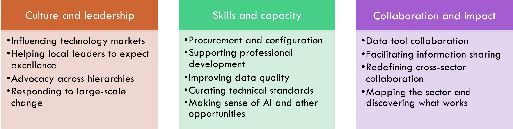

# Appendix 3: More on models for delivery

A Centre of Excellence could take many forms. We don’t believe that its role is to do all of everything that we’ve detailed above; that’s the work of the whole sector, and of individual professionals and their teams, to ensure that their services’ support functions remain effective. The Centre of Excellence should help to make sure that:

-  the sector’s data and digital ecosystem **works**,

-  **excellence** proliferates across administrative boundaries,

-  local services help **children**, and

-  national data and digital **enablers** are well delivered and maintained.

Whatever a Centre of Excellence might grow into over time, it will need to begin life as a financially, structurally, and relationally *viable *organisation, so it’s as much our job to consider the possible shape of the service as to specify its outputs, and for that we want to pay attention to models which work in the kinds of complex system we want the Centre of Excellence to support.

>A complex system that works is invariably found to have evolved from a simple system that worked.
> A complex system designed from scratch never works and cannot be patched up to make it work.
> You have to start…with a working simple system.
>
> -- John Gall, *Systemantics: How Systems Really Work and How They Fail*

We think that our – and our colleagues’ – ongoing efforts represent examples of simple systems that work, and we think that the Centre of Excellence should organise its initial activity around approaches we know work, with a straightforward organisation structure owning clearly defined delivery domains.

We’ve aligned the range of focus areas discussed above into three delivery strands, modelled on the DfE’s pre-existing discovery work which informed the Centre of Excellence concept.

Over time, this picture may become more complex, but starting a new organisation isn’t easy. It will only work if we begin with a clear, prioritised vision.

### Possible models

To explore viable delivery models for the Centre of Excellence, **we need to learn from what currently works** in our sector, or similar problem spaces. We’re looking at what works and doesn’t work for changing things, and identifying key constraints around which we think the Centre of Excellence should shape its work.

We want to consider a range of analogous organisations and projects as part of our original efforts to conceive possible models for a Centre of Excellence, including these which colleagues within our consortium have had direct experience of supporting in some way:

-  Previously government-established independent organisations like Foundations (the What Works Centre for Children’s Social Care and Early Help)57

-  The live projects to establish Regional Care Co-operatives in Greater Manchester and the South East58

-  Local Authority-originating organisations like Data to Insight, the Commissioning Alliance59, and NCER60

-  Other local Authority-focused convening and support organisations like the Local Government Association (LGA) and the Association of Directors of Children’s Services (ADCS)61

-  Charity groups like Coram

-  Private companies, whether for-profit or non-profit, like Social Finance, ICT Revolutions, and companies operating traditional consultancy models62

**It’s too early to say what we think will work best** for the Centre of Excellence. This paper’s purpose is to provoke insight and advice from across the sector and beyond, and to help us gain that insight we’re sharing our initial feelings, and reasonings, about where this work may go.

Below, we discuss key factors for consideration in identifying a suitable shape for the Centre of Excellence. Some of this reasoning is less well-supported by citable evidence than earlier sections of the report; as elsewhere, we welcome feedback which can help us to change or refine our understanding. Seeking that evidence will be part of the work we do ourselves in our further design efforts.

### Possible legal forms

While we recognise the uncertainties of future funding and political contexts, and the evolving nature of the services we’re specifying, we think **it’s important to consider legal forms early**, because some shapes of organisation are more suitable for some purposes, and we want to ensure we align the Centre of Excellence’s legal form with the kind of work we want it to do. These are examples of the kinds of options we’re considering as we design.

#### Creating a new legal entity

Members of our team have experience of supporting new organisations within our sector as new legal entities, for example limited companies like the What Works Centres (fairly large organisations) and the Regional Care Co-operatives (fairly small ones).

#### Local authority hosting

Data to Insight has been hosted by East Sussex County Council since appointing its first dedicated employee. Nor is it the only organisation to benefit from LA hosting in the way it does; services like the Commissioning Alliance, hosted by Ealing Council, also show the scale and impact that LA-hosted services can have beyond their host LA’s boundaries.

#### Central government hosting

Our consortium has worked extensively with central government, not only across multiple data and digital projects with the Department for Education, but also the Department for Health and Social Care, the Department for Work and Pensions, and the Ministry for Housing, Communities, and Local Government.

#### Aligning with existing infrastructure

In the same way that we believe the Centre of Excellence should be designed with, and by, the sector, as the best way of ensuring it meets the sector’s real needs in suitable ways, we recognise a number of existing organisations supporting LAs which could feasibly host all or part of the Centre of Excellence’s capabilities. Membership organisations like the LGA and ADCS, charities like the Coram group of charities, and larger sector-facing organisations like Foundations, among others, already operate as viable for-good organisations, with established infrastructure and business models.

#### Other examples

We know there is an enormous amount of exciting and valuable work happening in different areas of the public sector, from co-operative website infrastructure (e.g. LocalGov Drupal63) to professional accreditation for analysts in adjacent professions64, and a long history of collaborative work through different structures in the children's services sector. Through our engagement, we may discover options beyond those outlined above, and we’re eager to hear from colleagues with experience of, or ideas about, effective ways to deliver the kinds of support we’re envisaging.

#### Considerations applicable to all options

Whatever options we explore, there are some considerations which apply universally. When designing the mechanisms by which the Centre of Excellence will function, sustain itself, and deliver value, we will need to consider:

-  **How councils are organised**, and what kinds of help individual LA officers can access without approval from elsewhere in their organisations

-  **How previous DfE and third-party support offers have been received** by LAs, and why they did or did not gain the traction they sought, for example by evaluating delivery partners and other LA support offers

-  **How support offers and products can be sustained** when innovation funding ends, and which kinds of support offers and products are therefore viable for different delivery models

-  **What support and what technical offers already exist** in the sector, and what niche the Centre of Excellence should fit into with the support it provides

We don’t intend the above list to be comprehensive, but we welcome our colleagues’ thoughts on other specific key factors they would like us to consider.

<!--- footnotes -->

57 [https://foundations.org.uk/](https://foundations.org.uk/)

58 [https://www.gov.uk/government/publications/regional-care-co-operatives-pathfinder-areas/regional-care-cooperatives-rccs-pathfinder-regions](https://www.gov.uk/government/publications/regional-care-co-operatives-pathfinder-areas/regional-care-cooperatives-rccs-pathfinder-regions)

59 [https://commissioningalliance.co.uk/](https://commissioningalliance.co.uk/)

60 [https://www.ncer.org/Index.aspx](https://www.ncer.org/Index.aspx)

61 [https://www.adcs.org.uk/](https://www.adcs.org.uk/)

62 Not listed beyond our identified consortium members for the sake of impartiality

63 [https://localgovdrupal.org/](https://localgovdrupal.org/)

64[https://www.aphanalysts.org/](https://www.aphanalysts.org/)

<!--- feedback form only below here -->

  <h2>Page feedback</h2>
  <form id="gs-form">
    <input type="hidden" name="page" id="gs-page">
    <input type="text" name="hp_field" id="hp_field" style="display:none" tabindex="-1" autocomplete="off">

    <label for="mf-nature">Reflection on our thinking from this page</label>
    <select id="mf-nature">
      <option value="">— Select (optional) —</option>
      <option>I’m enthusiastic about this</option>
      <option>I’m unsure about this</option>
      <option>I disagree with this</option>
      <option>I have a general reflection on this</option>
      <option>I’ve identified a specific issue with this</option>
      <option>Other</option>
    </select>
    
    <label for="gs-summary" class="sr-only">Summary</label>
    <input type="text" name="summary" id="gs-summary" required minlength="5" placeholder="Brief summary (required)">

    <label for="gs-details" class="sr-only">Details</label>
    <textarea name="details" id="gs-details" rows="3" placeholder="Details (optional)"></textarea>

    <label for="mf-role">Your role *</label>
    <select id="mf-role" required>
      <option value="">— Select your role —</option>
      <option>Local authority data professional</option>
      <option>Local authority digital professional</option>
      <option>Local authority children’s social care professional</option>
      <option>Local authority leadership</option>
      <option>Central government data professional</option>
      <option>Central government digital professional</option>
      <option>Central government social care professional</option>
      <option>Central government leadership</option>
      <option>Other public sector professional role</option>
      <option>Data and digital supplier/partner</option>
      <option>Data and digital consultant</option>
      <option>Other private sector professional role</option>
      <option>Person (with current or previous social care involvement as a service user)</option>
      <option>Person (without current or previous social care involvement as a service user)</option>
    </select>

    <label for="mf-org">Your organisation (optional)</label>
    <input type="text" id="mf-org" placeholder="Organisation">

    <label for="mf-email">Your email (optional, for follow-up only)</label>
    <input type="email" id="mf-email" placeholder="you@example.org">

    

      <button type="submit" class="md-button">Submit feedback</button>
    

    
Thanks — feedback received

    
Sorry — something went wrong

  </form>

