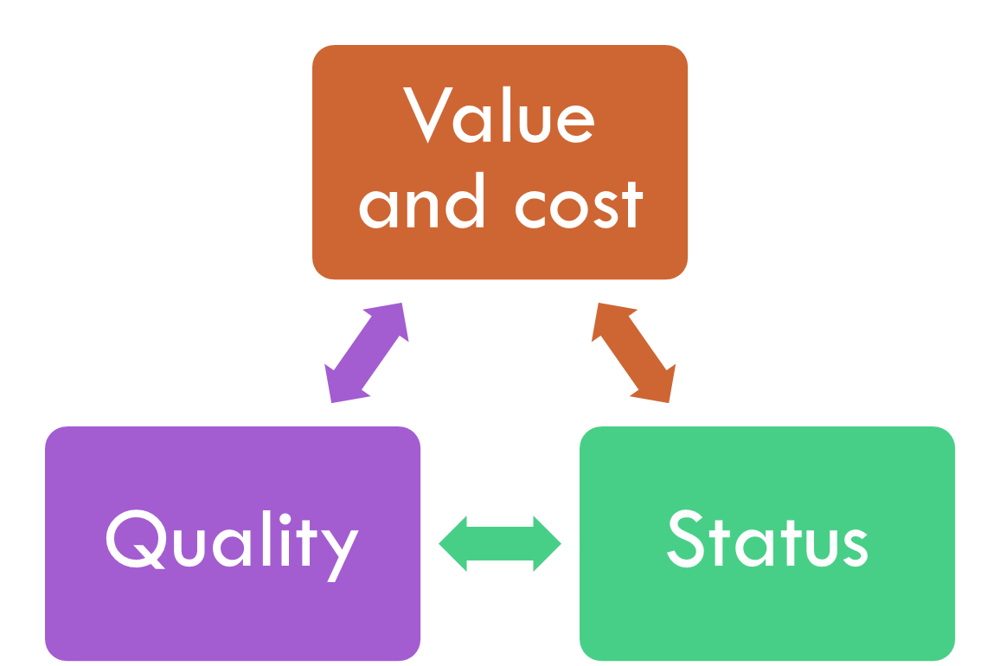
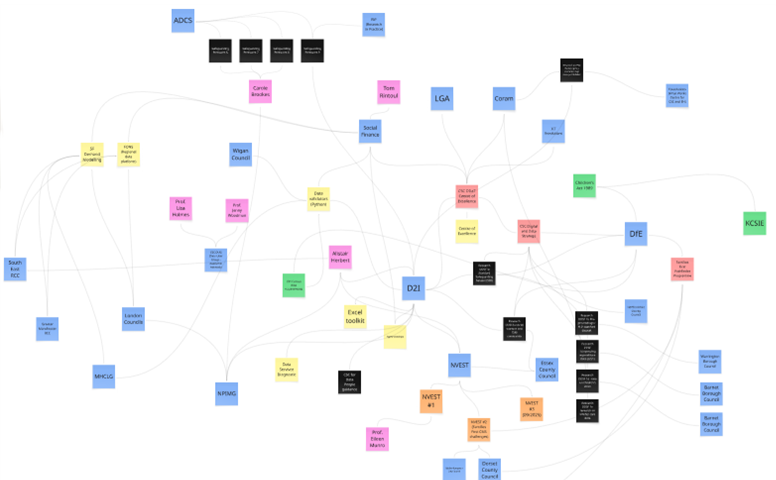

# How our system works

There’s more than one way to frame the context of CSC data and digital work.

Often, the work happens across multiple people, business units, and organisations, and overlaps with other functions. The data team supporting children’s services in a local authority might also support adults services; the dataset a local authority relies on might also be important to central government or a third party. Any boundaries we draw around these areas of work will be somewhat artificial.

To describe all of this, we focus on key aspects of the sector’s work which we think impact its effectiveness:

-  The **context** of the work – its data, technology, common practices, legislation, and changes

-  The **status** of the work – roles, resources, leadership context, and ownership

-  The **value** of the work – impact, integration with strategic leadership, and outcomes focus

-  The **quality** of the work – accuracy, competence, know-how, technology, and peer networks

-  The **cost **of the work – its external costs, internal costs, and cost control and volatility

These aspects relate to each other in complex ways as part of an inter-related system, and it’s therefore possible to view the above as an inter-dependent system of factors.3

Diagrams like the one below are essentially very simplified system maps explaining how the important elements of a system work, and what outputs the system produces. A good one helps us understand the dynamics at play, and what we can do to help the system perform well.

In some ways, and **in some LAs, this system has become a vicious cycle**. Data and digital work has provided insufficient value to service leaders, and in time this has led to the status of the work diminishing, resulting in reduced resource and necessarily lower quality, which further reduces possible value.

To compound this difficulty, the LAs who could most benefit from external support are often those which are least equipped to access it. Whether due to resource constraints, ineffective leadership, or any other factor, we infer from engagement with Data to Insight projects4 that some LAs are so well-equipped that their only real engagement with our work is to help us deliver it well to other LAs, and other LAs are so poorly-equipped to engage with external partners that they cannot spare the time to evaluate our free tools for local use. We think some LAs are experiencing the above interplay of factors unhelpfully to the extent that they struggle to perform data and digital work beyond limited statutory obligations.

Not only is it possible to alter the direction of this cycle and convert it into a virtuous cycle, but we can see it happening in various examples across the sector. Where the work delivers value, the status of the work improves, enabling professionals to deliver higher quality work which increases its value to service leaders.

In short, **there are huge opportunities for us to improve safeguarding services by improving our data and digital work**. There are processes and practices we can interrogate, optimize, transform, and share.

A successful Centre of Excellence will provide resources and direct support to local authorities, but we think it must also play a key role in understanding the sector and identifying ways to influence that system towards excellence. It will identify the missing elements, or enablers, which can kickstart local improvements and empower analysts and other professionals to deliver enabling services which their practice leaders can rely on.

But this work goes beyond optimizing technical processes. It’s equally about understanding the cycles and systems within which this work happens, and how we can influence them to create conditions for success in as many local authorities as possible. There are specific interventions we can make to unblock system constraints and restart improvement processes.

<!-- footnotes -->
3 Our favourite introduction to systems thinking is Donella Meadows, *Thinking in Systems*

4 Internal Data to Insight website metrics are not published in deference to our terms of use with LA colleagues

<!-- feedback form -->

  <h2>Page feedback</h2>
<form id="gs-form">
  <input type="hidden" name="page" id="gs-page">
  <input type="text" name="hp_field" id="hp_field" style="display:none" tabindex="-1" autocomplete="off">

  <label for="mf-nature">Reflection on our thinking from this page</label>
  <select id="mf-nature" name="nature">
    <option value="">— Select (optional) —</option>
    <option>I’m enthusiastic about this</option>
    <option>I’m unsure about this</option>
    <option>I disagree with this</option>
    <option>I have a general reflection on this</option>
    <option>I’ve identified a specific issue with this</option>
    <option>Other</option>
  </select>

  <label for="gs-summary" class="sr-only">Summary</label>
  <input type="text" id="gs-summary" name="summary" required minlength="5" placeholder="Brief summary (required)">

  <label for="gs-details" class="sr-only">Details</label>
  <textarea id="gs-details" name="details" rows="3" placeholder="Details (optional)"></textarea>

  <label for="mf-role">Your role *</label>
  <select id="mf-role" name="role" required>
    <option value="">— Select your role —</option>
      <option>Local authority data professional</option>
      <option>Local authority digital professional</option>
      <option>Local authority children’s social care professional</option>
      <option>Local authority leadership</option>
      <option>Central government data professional</option>
      <option>Central government digital professional</option>
      <option>Central government social care professional</option>
      <option>Central government leadership</option>
      <option>Other public sector professional role</option>
      <option>Data and digital supplier/partner</option>
      <option>Data and digital consultant</option>
      <option>Other private sector professional role</option>
      <option>Person (with current or previous social care involvement as a service user)</option>
      <option>Person (without current or previous social care involvement as a service user)</option>
  </select>

  <label for="mf-org">Your organisation (optional)</label>
  <input type="text" id="mf-org" name="org" placeholder="Organisation">

  <label for="mf-email">Your email (optional, for follow-up only)</label>
  <input type="email" id="mf-email" name="email" placeholder="you@example.org">

  

    <button type="submit" class="md-button">Submit feedback</button>
  

  
Thanks — feedback received

  
Sorry — something went wrong

</form>

