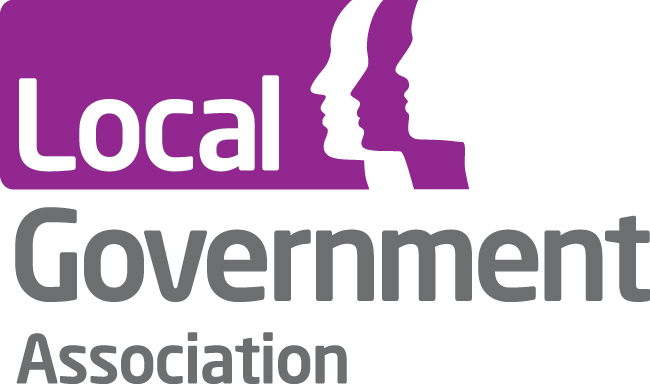

# Imagining a Centre of Excellence for Children’s Services Data and Digital Professionals

### The D2I Consortium
<!--- self-contained logo block (css only applies here) -->

<table class="gallery">
  <tr>
    <td></td>
    <td></td>
    <td></td>
    <td></td>
    <td></td>
  </tr>
</table>
<!--- end of logo block -->

Last updated: 2025-10-22

Please navigate using search icon or left side menu (or top menu if browsing on mobile). An accompanying PDF copy of this material is available at [*https://www.datatoinsight.org/coe*](https://www.datatoinsight.org/coe)

