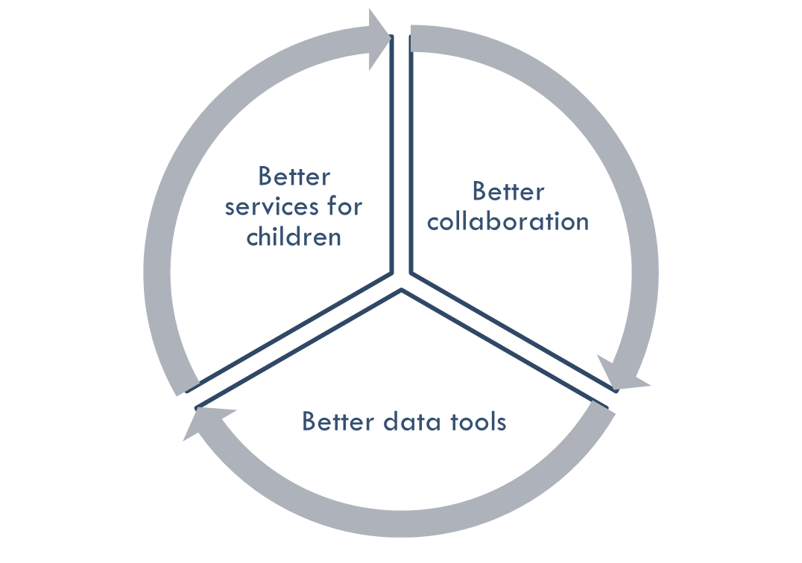
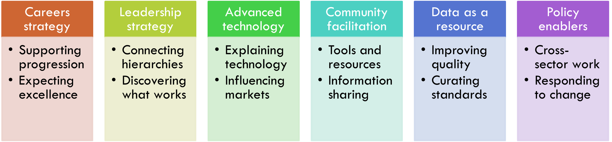
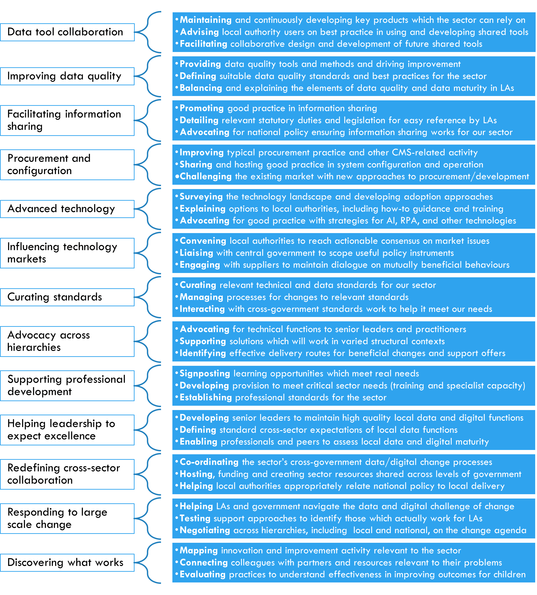

# Possible mechanisms for change

There’s a difference between knowing how things ought to work, and being able to make them work that way. **We intend to design a Centre of Excellence with optimistic goals and pragmatic approaches**.

When we started to work together to improve data work in children’s services via Data to Insight, we identified a core positive feedback loop which would guide our activity.5

By finding ways for people across the sector to work together, we make better tools, which helps local authorities deliver better services. The better the services, the more likely that they join future collaborations, and the more useful their contributions, meaning the work improves over time.

This mechanism works. We have better shared tools[^6] and data collections[^7] with a wider range of sponsors and owners, and LA colleagues tell us these help them work more effectively to support children.

Below, we outline what we think a Centre of Excellence could do, and the ways of doing these things which are most likely to work in the real world.

Within each of these conceptual areas, we might imagine an endless list of possible activities. For the purposes this paper, we’ve limited ourselves to three examples per theme, making thirty-six ideas. **We want to know if you think that these ideas are ‘right’**; if they’re logically sound, and if they’re properly scaled, but most importantly if they’re true and useful.

We need to stress that **these are ideas, not commitments**. We’ll test further through this project.

For detailed discussion of these elements, and the reasoning which leads us to our initial assumptions, see Appendix 2. The below diagram outlines those elements and related example activities.

<!--- footnotes -->

5 As discussed in [this article published by MHCLG](https://medium.com/ldcu/council-spotlight-november-b6e647d44041)

<!--- feedback -->

  <h2>Page feedback</h2>
<form id="gs-form">
  <input type="hidden" name="page" id="gs-page">
  <input type="text" name="hp_field" id="hp_field" style="display:none" tabindex="-1" autocomplete="off">

  <label for="mf-nature">Reflection on our thinking from this page</label>
  <select id="mf-nature" name="nature">
    <option value="">— Select (optional) —</option>
    <option>I’m enthusiastic about this</option>
    <option>I’m unsure about this</option>
    <option>I disagree with this</option>
    <option>I have a general reflection on this</option>
    <option>I’ve identified a specific issue with this</option>
    <option>Other</option>
  </select>

  <label for="gs-summary" class="sr-only">Summary</label>
  <input type="text" id="gs-summary" name="summary" required minlength="5" placeholder="Brief summary (required)">

  <label for="gs-details" class="sr-only">Details</label>
  <textarea id="gs-details" name="details" rows="3" placeholder="Details (optional)"></textarea>

  <label for="mf-role">Your role *</label>
  <select id="mf-role" name="role" required>
    <option value="">— Select your role —</option>
      <option>Local authority data professional</option>
      <option>Local authority digital professional</option>
      <option>Local authority children’s social care professional</option>
      <option>Local authority leadership</option>
      <option>Central government data professional</option>
      <option>Central government digital professional</option>
      <option>Central government social care professional</option>
      <option>Central government leadership</option>
      <option>Other public sector professional role</option>
      <option>Data and digital supplier/partner</option>
      <option>Data and digital consultant</option>
      <option>Other private sector professional role</option>
      <option>Person (with current or previous social care involvement as a service user)</option>
      <option>Person (without current or previous social care involvement as a service user)</option>
  </select>

  <label for="mf-org">Your organisation (optional)</label>
  <input type="text" id="mf-org" name="org" placeholder="Organisation">

  <label for="mf-email">Your email (optional, for follow-up only)</label>
  <input type="email" id="mf-email" name="email" placeholder="you@example.org">

  

    <button type="submit" class="md-button">Submit feedback</button>
  

  
Thanks — feedback received

  
Sorry — something went wrong

</form>

